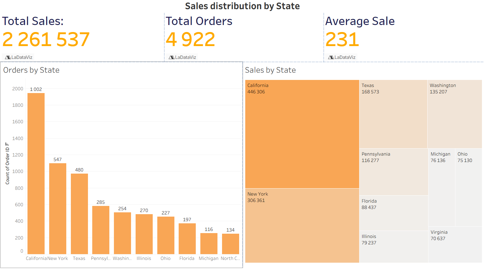
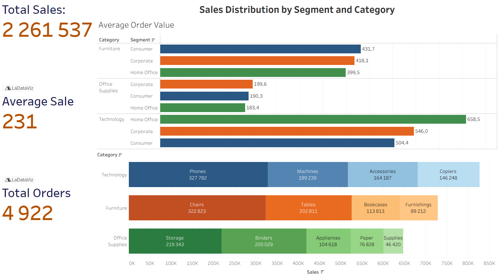
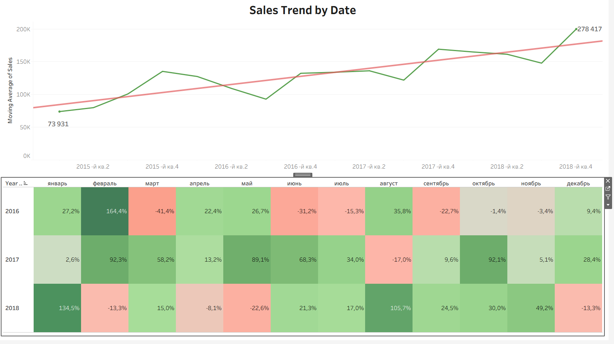

                                                  --- Sales Trends Analysis Dashboards ---
This repository contains three dashboards analyzing sales performance and yearly growth trends using Python and Tableau. Screenshots included for quick preview.

                                                              Dashboard 1: 

**Insight:**
The bar chart shows the number of orders by state, while the map visualizes revenue by state. Interestingly, states with the highest number of orders are not always the ones generating the most revenue, highlighting different performance patterns.The filter allows exploring additional states beyond the top performers.                                                                                                                                                      
**Conclusion:**
Order volume and revenue do not always align across states, providing insights for targeted sales and marketing strategies.

                                                              Dashboard 2:

**Insight:**                                                                                                                                        
Revenue is concentrated in specific categories and their key segments. The stacked bars highlight which products contribute most to each category, while sales, average order value, and order volume metrics help identify top-performing areas.                                                                    
**Conclusion:**
Focusing on strong segments and categories allows optimizing marketing and sales strategies, identifying priority products and customer groups.

                                                              Dashboard 3:

**Insight:**
The line chart shows a clear upward trend in average sales over the years, indicating steady growth. The heatmap visualizes revenue changes as a percentage relative to the same month of the previous year, highlighting periods of growth and decline across months and years.                                        
**Conclusion:**
Sales are growing year over year, with seasonal variations in profit. This information helps plan resources and make strategic business decisions.
